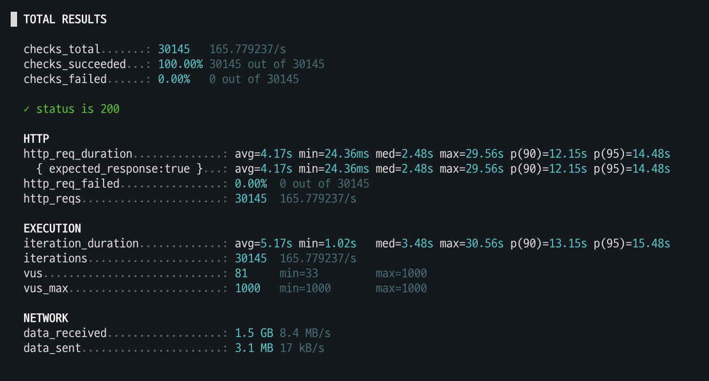
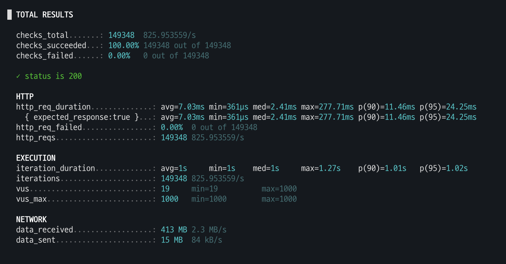

# 🚀 Redis Cache Integration & Performance Tuning

Spring AOP 기반의 커스텀 어노테이션을 활용하여 Redis 캐싱 레이어를 구현하고, k6 부하 테스트를 통해 시스템 성능 개선을 확인함.

---

## 🏗️ 1. Redis Cache Implementation

Spring AOP와 커스텀 어노테이션을 활용하여 비즈니스 로직 변경을 최소화하고, 재사용성과 확장성을 고려한 캐싱 구조를 설계했습니다.

### 📁 Architecture & File Overview

| 파일명 | 역할 및 핵심 기능 |
| :--- | :--- |
| **`Cacheable.java`** | 메서드 단위의 캐싱 선언을 위한 커스텀 어노테이션 (`key1`, `key2`, `ttl` 설정) |
| **`IgnoreCache.java`** | 강제 DB 조회/캐시 우회가 필요한 조건 파라미터 지정용 어노테이션 |
| **`CacheAspect.java`** | Spring AOP 관점 정의. 캐시 키 동적 생성, 우회 조건 판별 및 `CacheUtil` 연동 |
| **`RedisConfig.java`** | Redis 키 직렬화 방식(`StringRedisSerializer`) 및 `RedisTemplate` 설정 |
| **`StoryService.java`** | `@Cacheable` 어노테이션을 적용하여 실제 캐싱 처리된 데이터 조회 서비스 예시 |

<br>

### 🔑 Key Code Details

#### 1) `@Cacheable` & `@IgnoreCache` (Custom Annotations)
```java
// Cacheable.java - 메서드 단위 캐시 선언
@Target(ElementType.METHOD)
@Retention(RetentionPolicy.RUNTIME)
public @interface Cacheable {
    String key1();               // 캐시 키 Prefix / 네임스페이스
    String key2() default "";    // 캐시 키 Suffix (미지정 시 파라미터 기반 자동 생성)
    long ttl() default 3600;     // TTL (초 단위, 기본 1시간)
}

// IgnoreCache.java - 특정 조건 시 캐시 우회
@Target(ElementType.PARAMETER)
@Retention(RetentionPolicy.RUNTIME)
public @interface IgnoreCache {}
```

#### 2) `CacheAspect.java` (AOP Aspect)

* **동적 키 조립**: `key2`가 비어 있는 경우 메서드 파라미터 중 문자열/숫자 데이터를 추출하여 `:param1:param2...` 형태로 자동 결합합니다.
* **캐시 우회 제어**: `@IgnoreCache` 어노테이션이 지정된 파라미터의 값이 `true`일 경우 캐시 조회를 건너뛰고 원본 로직을 실행합니다.

```java
@Around("@annotation(cacheable)")
public Object cacheAround(ProceedingJoinPoint joinPoint, Cacheable cacheable) throws Throwable {
    // 1. 기본 캐시 키 및 TTL 추출
    String key1 = String.valueOf(cacheable.key1()).replace("\"", "");
    String key2 = cacheable.key2() != null ? cacheable.key2().replace("\"", "") : "";
    long ttl = cacheable.ttl();

    // 2. key2 미지정 시 파라미터 기반 동적 키 생성
    Object[] args = joinPoint.getArgs();
    if (key2.isEmpty() && args.length > 0) {
        key2 = Arrays.stream(args)
                .filter(arg -> arg instanceof String || arg instanceof Number)
                .map(Object::toString)
                .reduce(key2, (key, arg) -> key + ":" + arg);
        if (key2.length() > 1) key2 = key2.substring(1);
    }

    // 3. @IgnoreCache 파라미터 체크를 통한 캐시 우회 여부 확인
    MethodSignature signature = (MethodSignature) joinPoint.getSignature();
    Method method = signature.getMethod();
    boolean ignoreCache = false;
    Annotation[][] parameterAnnotations = method.getParameterAnnotations();
    if (args.length > 0 && parameterAnnotations.length > 0) {
        for (int i = 0; i < args.length; i++) {
            if (args[i] instanceof Boolean && ((Boolean) args[i])) {
                for (Annotation annotation : parameterAnnotations[i]) {
                    if (annotation instanceof IgnoreCache) {
                        ignoreCache = true;
                        break;
                    }
                }
            }
            if (ignoreCache) break;
        }
    }

    // 4. CacheUtil을 통해 캐시 조회 또는 원본 로직 수행
    Type returnType = method.getGenericReturnType();
    return cacheUtil.getCache(key1, key2, () -> {
        try {
            return joinPoint.proceed();
        } catch (Throwable throwable) {
            throw new RuntimeException("API 호출 중 오류 발생", throwable);
        }
    }, ttl, returnType, ignoreCache);
}
```

#### 3) `StoryService.java` (Application Example)

```java
@Slf4j
@Service
@RequiredArgsConstructor
public class StoryService {
    private final StoryRepository storyRepository;

    // WEB_STORY_LIST 키를 기반으로 24시간(86,400초) 동안 결과 캐싱
    @Cacheable(key1 = RedisConst.WEB_STORY_LIST, ttl = 60 * 60 * 24)
    public RestPage<StoryDto> getStoryList(PageRequest pageable) {
        return storyRepository.search(pageable);
    }
}
```


## ⚡ 2. Performance Tuning Results (k6 Load Test)

동시 사용자 1,000명(VUs: 1000) 부하 상황에서 Redis 캐싱 적용 전/후 성능을 k6를 통해 비교 측정하였습니다.

### 📊 성능 비교 요약

| 지표 (Metric) | Non-Caching (DB 직접 조회) | Caching (Redis 적용) | 개선 성과 |
| :--- | :---: | :---: | :---: |
| **초당 처리량 (Throughput)** | `165.78 req/s` | **`825.95 req/s`** | **📈 약 500% 향상 (5배)** |
| **평균 응답시간 (Avg Latency)** | `4,170 ms` | **`7.03 ms`** | **⚡ 약 99.8% 단축 (593배)** |
| **P95 응답시간 (P95 Latency)** | `14,480 ms` | **`24.25 ms`** | **⚡ 약 99.8% 단축 (597배)** |
| **최대 응답시간 (Max Latency)** | `29.56 s` | **`0.27 s (277ms)`** | **⚡ 약 99.0% 단축** |

---

### 🎯 Key Takeaways & Impact

* **DB 병목 현상 완화**: 반복되는 조회 요청을 In-memory 데이터베이스인 Redis에서 즉시 처리하도록 개선하여 DB의 I/O 락 및 CPU 부하를 근본적으로 해결했습니다.
* **사용자 경험(UX) 극대화**: 고부하 상황에서도 95% 이상의 요청이 **25ms 이내**로 응답받아 쾌적한 서비스를 유지할 수 있게 되었습니다.
* **시스템 가용성 증대**: 동일한 서버 스펙에서 **초당 처리량(RPS)을 5배 이상** 끌어올려 대규모 트래픽 대응 능력을 확보했습니다.

---

### 🖼️ Benchmark Captures

| Non-Caching (DB 직접 조회) | Caching (Redis 적용) |
| :---: | :---: |
|  |  |
